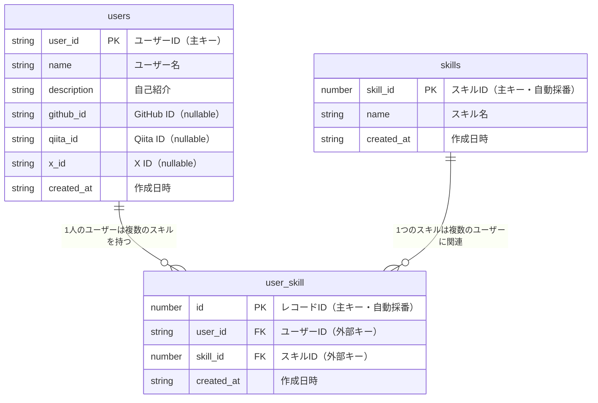

# デジタル名刺アプリ

[](https://www.typescriptlang.org/)
[](https://react.dev/)
[](https://vitejs.dev/)
[](https://www.chakra-ui.com/)

> シンプルで使いやすいデジタル名刺管理システム

ユーザーIDから名刺情報を検索し、技術スキルやSNSアカウント情報を簡単に共有できるWebアプリケーションです。

## 機能概要

- **名刺検索**: ユーザーIDから名刺情報を検索・表示
- **名刺登録**: 新しい名刺情報の登録（名前、自己紹介、SNSアカウント、技術スキル）
- **スキル管理**: 最大3つまでの技術スキルを選択可能
- **SNS連携**: GitHub、Qiita、X（旧Twitter）のアカウント情報を登録
- **ダークモード**: ライト/ダークテーマの切り替え対応

## 技術スタック

- **Frontend**: React 19, TypeScript
- **Build Tool**: Vite
- **Routing**: TanStack Router
- **State Management**: TanStack Query
- **UI Framework**: Chakra UI v3
- **Form Management**: React Hook Form
- **Database**: Supabase (PostgreSQL)
- **Testing**: Vitest, React Testing Library
- **Code Quality**: Biome

## プロジェクト構成

```
kadai4/
├── src/
│   ├── routes/              # ページルート
│   │   ├── index.tsx        # トップページ（名刺検索）
│   │   ├── cards/
│   │   │   ├── $id.tsx      # 名刺詳細ページ
│   │   │   ├── register/    # 名刺登録ページ
│   │   │   ├── -components/ # カード機能用コンポーネント
│   │   │   ├── -api/        # API関連ロジック
│   │   │   └── -lib/        # ユーティリティ・定数
│   │   └── __root.tsx       # ルートレイアウト
│   ├── components/          # 共通コンポーネント
│   │   └── ui/              # Chakra UIコンポーネント
│   ├── types/               # TypeScript型定義
│   └── main.tsx             # アプリケーションエントリーポイント
├── tests/                   # テストファイル
│   ├── routes/              # ルートのテスト
│   ├── mock/                # モックデータ
│   └── utils/               # テストユーティリティ
├── public/                  # 静的ファイル
└── database/                # データベーススキーマ・マイグレーション
```

## データベース構造

### ER図



### テーブル説明

#### users テーブル
- ユーザーの基本情報を格納
- `user_id`は好きな単語をユニークIDとして使用
- SNSアカウント情報はオプション

#### skills テーブル
- 技術スキルのマスターデータ
- 予め登録された技術の一覧

#### user_skill テーブル
- usersとskillsの中間テーブル
- 多対多の関係を実現
- 1人のユーザーは最大3つまでのスキルを選択可能（アプリケーション制約）

## ローカル開発手順

### 必要な環境

- Node.js 18以上
- pnpm 9以上
- Supabaseアカウント

### 環境セットアップ

1. **リポジトリのクローン**
```bash
git clone https://github.com/mkiin/kadai4.git
cd kadai4
```

2. **依存関係のインストール**
```bash
pnpm install
```

3. **環境変数の設定**

`.env`ファイルをプロジェクトルートに作成し、Supabase接続情報を設定：

```bash
VITE_SUPABASE_URL=your_supabase_url
VITE_SUPABASE_ANON_KEY=your_supabase_anon_key
SUPABASE_PROJECT_ID=your_project_id
```

4. **開発サーバーの起動**
```bash
pnpm run dev
```

アプリケーションは [http://localhost:3000](http://localhost:3000) で起動します。

### よく使うコマンド

```bash
pnpm run dev              # 開発サーバー起動（ポート3000）
pnpm run build            # 本番ビルド
pnpm run serve            # ビルドしたアプリをプレビュー
pnpm run test             # テスト実行
pnpm run check            # コードフォーマット＆リント
pnpm run generate-types   # Supabaseから型定義を生成
```

## データベース型定義の生成

Supabaseのデータベーススキーマから型定義を生成する場合：

```bash
pnpm run generate-types
```

生成された型定義は [src/types/database.types.ts](src/types/database.types.ts) に保存されます。

## テスト

```bash
pnpm run test
```

テストは以下を含みます：
- ルートコンポーネントのテスト
- ユーザーインタラクションのテスト
- APIクエリのモックテスト

## デプロイ

### Firebase Hosting

このプロジェクトはFirebase Hostingへのデプロイ設定が含まれています。

```bash
pnpm run build
firebase deploy
```

## ライセンス

このプロジェクトはMITライセンスの下で公開されています。
