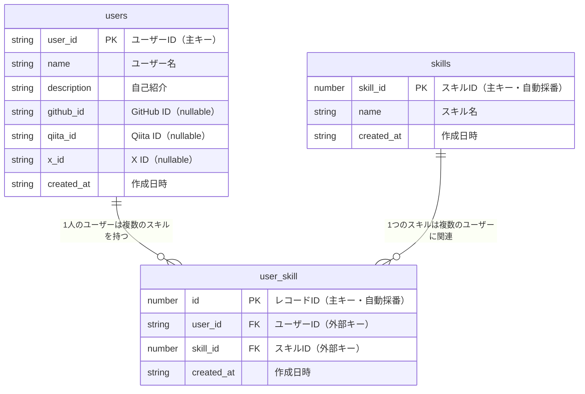

# Jisou App - 名刺管理アプリケーション

# 要件

- ユーザーIDを入力できる
- 入力しているIDの候補を出す
- 入力しているIDがない場合、エラーをだす。
- 入力しているIDがある場合、/card/{id}にリダイレクトする

# 機能

- コンボボックスコンポーネントでIDを入力することができる
- tanstack queryにより、初回ロードでidセットを取得する
- もしくは、入力中にget queryをするか？
  - 前者の方法なら、idセット内に無いidを入力した場合に、エラー表示
  - 後者の方法なら、queryエラーによりエラー表示
- zodスキーマは使用しない。react hoook formのネイティブバリデーションで対応する。

## データベース構造

### ER図

### テーブル説明

#### users テーブル
- ユーザーの基本情報を格納
- `user_id`は好きな単語をユニークIDとして使用
- SNSアカウント情報はオプション

#### skills テーブル
- 技術スキルのマスターデータ
- 予め登録された技術の一覧

#### user_skill テーブル
- usersとskillsの中間テーブル
- 多対多の関係を実現
- 1人のユーザーは最大3つまでのスキルを選択可能（アプリケーション制約）

### リレーション
- users 1 : N user_skill (1人のユーザーは複数のスキルを持てる)
- skills 1 : N user_skill (1つのスキルは複数のユーザーが持てる)
- user_skill テーブルにより、users と skills は多対多の関係